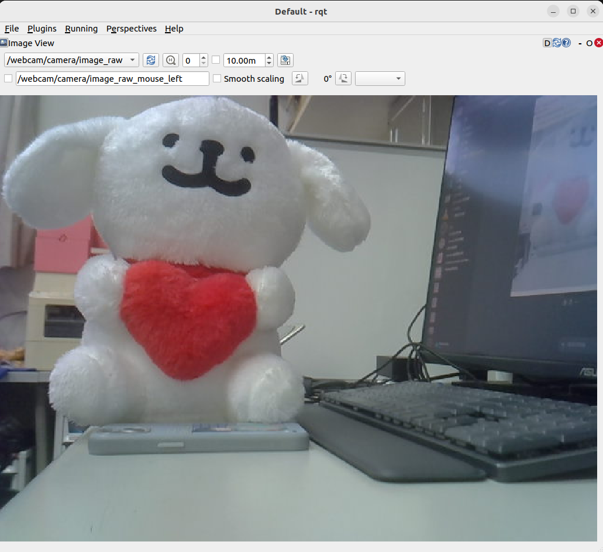

# <div align="center">AESIL - Image</div>

## <div align="center">Outline</div>

- [依賴項 (Dependencies)](#dependencies)
- [程式下載 (Downloads)](#downloads)
- [影像轉發 (Camera Image)](#image)
- [可視化模組 (RQT)](#rqt)

## <div align="center">Dependencies</div>

  ### [ 安裝 cv_bridge ]

  `官網連結:` [ cv_bridge [ROS2] ](https://index.ros.org/p/cv_bridge)  
  `官網連結:` [ cv_bridge [GitHub] ](https://github.com/ros-perception/vision_opencv.git)

  <details>
  <summary>Install</summary>

  *Step1* - 下載功能包

  ``` bash
  # <ros2-distro> 填入 ROS2 版本
  # Ex: git clone -b humble https://github.com/ros-perception/vision_opencv.git
  git clone -b <ros2-distro> https://github.com/ros-perception/vision_opencv.git
  ```

  *Step2* - 安裝依賴項

  ``` bash
  sudo apt install python3-numpy
  sudo apt install libboost-python-dev
  ```

  ---

  *Step3* - 編譯功能包

  ``` bash
  cd ~/vision_opencv/cv_bridge
  mkdir build
  cd build
  cmake -DCMAKE_INSTALL_PREFIX=/opt/ros/humble .. ## 預編譯 (指定存放路徑)
  sudo make install
  ```

  ---

  </details>

  ---

  ### [ 安裝 RQT 模塊化可視化工具 ]

  `官網連結:` [ rqt [ROS2] ](https://index.ros.org/p/rqt)  
  `官網連結:` [ rqt [GutHub] ](https://github.com/ros-visualization/rqt)  

  <details>
  <summary>Install</summary>

  ``` bash
  # <ros2-distro> 填入 ROS2 版本
  # Ex: sudo apt install ros-humble-rqt
  sudo apt install ros-<ros2-distro>-rqt
  ```

  </details>

  ---

## <div align="center">Downloads</div>

*Step1* - 下載至 ROS2 的工作空間

``` bash
cd ~/<your_workspace>/src
git clone https://github.com/FantasyWilly/AESIL-Image.git
```

--- 

*Step2* - 編譯工作空間

``` bash
colon build
source ~/.bashrc
```

---

## <div align="center">Image</div>

  ### [ 硬體連接 ]

  - Webcam 

    ``` bash
    ros2 run usb_img_pkg webcam_image_node
    ```

    `Node:` /webcam_image_node
  
    `Topic:` /webcam/camera/image_raw
    
    ---

  ### [ 串流地址 ]

  - RTSP, RTMP, HTTP  

    ``` bash
    ros2 run stream_img_pkg stream_image_node
    ```

    `Node:` /stream_image_node
  
    `Topic:` /stream/camera/image_raw
    
    ---

  ---

## <div align="center">RQT</div>

  ### [ 使用方法 ]

  ``` bash
  rqt
  ```

  

  ---
